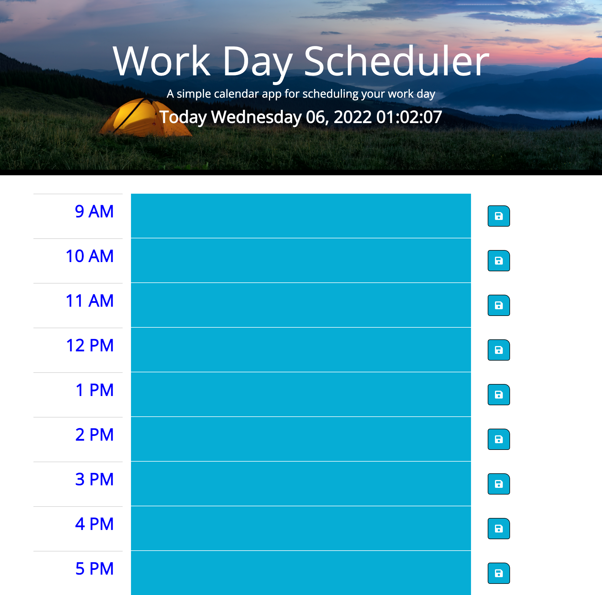
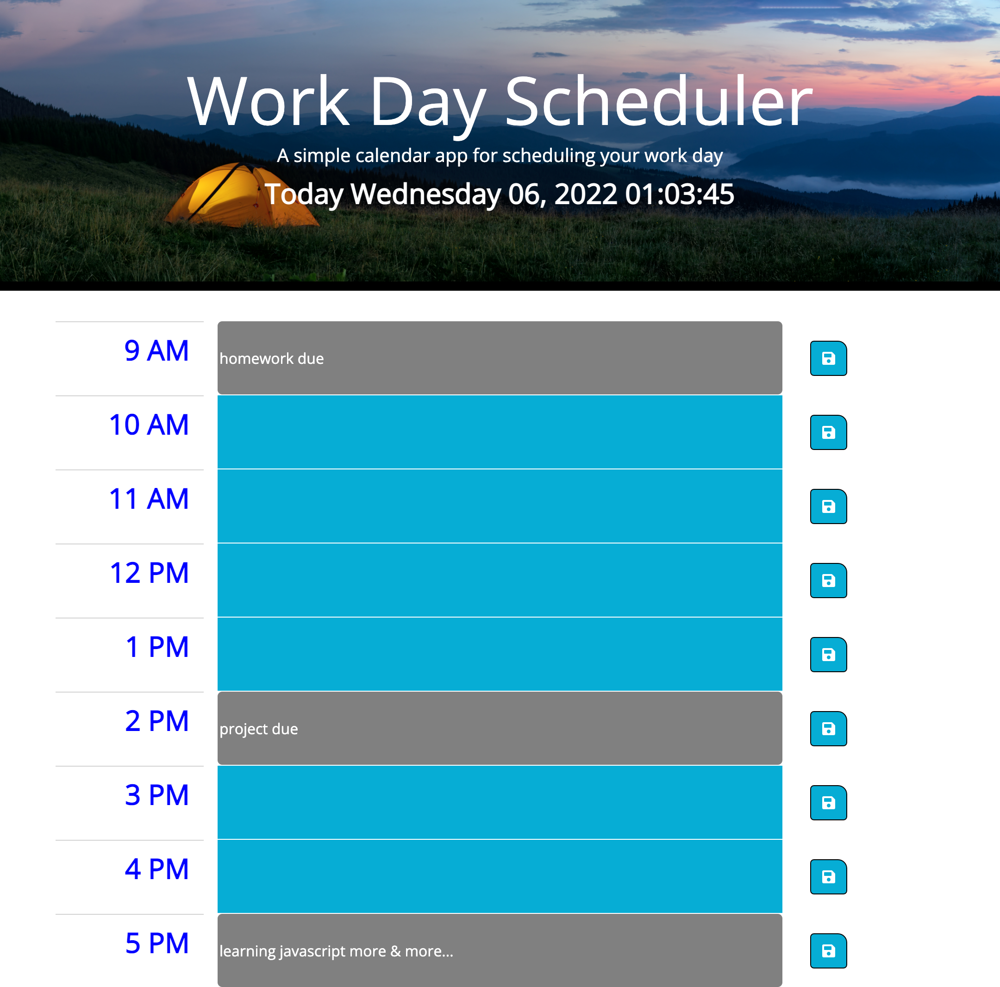

# 05 Jquery, Bootstrap APIs - Day Planner
# Dependencies
 - HTML
 - CSS
 - Javascripts
## Project

This project lean how to manipulate the DOM elements using Jquery, bootstrap and javascript.

## Criteria

```
GIVEN I am using a daily planner to create a schedule
WHEN I open the planner
THEN the current day is displayed at the top of the calendar
WHEN I scroll down
THEN I am presented with timeblocks for standard business hours
WHEN I view the timeblocks for that day
THEN each timeblock is color coded to indicate whether it is in the past, present, or future
WHEN I click into a timeblock
THEN I can enter an event
WHEN I click the save button for that timeblock
THEN the text for that event is saved in local storage
WHEN I refresh the page
THEN the saved events persist
```

# Usage
 You can run a local copy of this site by issuing the following commands. 
```bash
$ git clone https://github.com/vi3t4lov3/HW5-Day-Planner.git
$ cd HW5-Day-Planner
```
## Contributing
1. Fork it
2. Create your feature branch (`git checkout -b my-new-feature`)
3. Commit your changes (`git commit -am 'Add some feature'`)
4. Push to the branch (`git push origin my-new-feature`)
5. Create new Pull Request
## The Demo Page
https://vi3t4lov3.github.io/HW5-Day-Planner/




